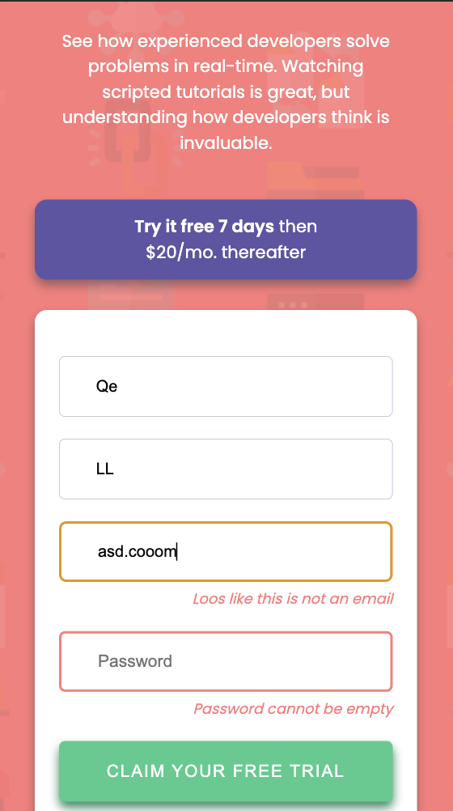
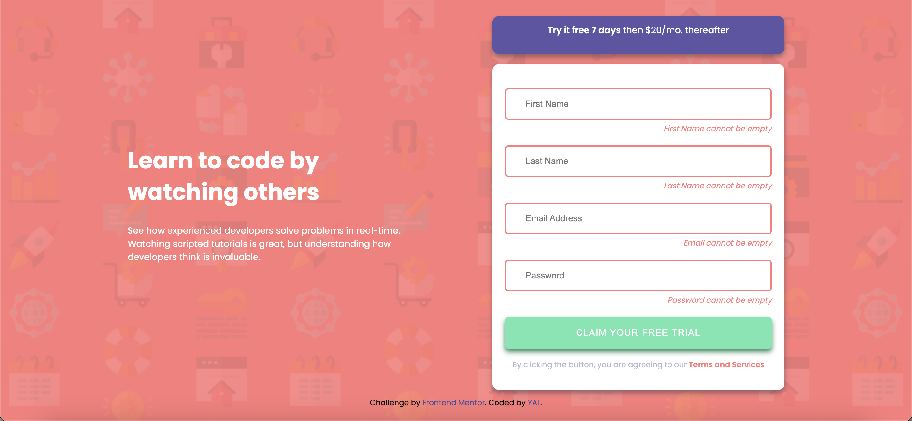

# Frontend Mentor - Intro component with sign up form solution
This is a solution to the [Intro component with sign up form challenge on Frontend Mentor](https://www.frontendmentor.io/challenges/intro-component-with-signup-form-5cf91bd49edda32581d28fd1). Frontend Mentor challenges help you improve your coding skills by building realistic projects. 

## Table of contents
- [Overview](#overview)
  - [The challenge](#the-challenge)
  - [Screenshot](#screenshot)
  - [Links](#links)
- [My process](#my-process)
  - [Built with](#built-with)
  - [What I learned](#what-i-learned)
  - [Continued development](#continued-development)
- [Author](#author)
- [Acknowledgments](#acknowledgments)


## Overview
### The challenge
Users should be able to:

- View the optimal layout for the site depending on their device's screen size
- See hover states for all interactive elements on the page
- Receive an error message when the `form` is submitted if:
  - Any `input` field is empty. The message for this error should say *"[Field Name] cannot be empty"*
  - The email address is not formatted correctly (i.e. a correct email address should have this structure: `name@host.tld`). The message for this error should say *"Looks like this is not an email"*

### Screenshot




### Links
- Live Site URL: https://yacodingroom.github.io/intro-with-signup-form/

## My process
### Built with
- Semantic HTML5 markup
- CSS custom properties
- Flexbox
- Mobile-first workflow
- jQuery validation

### What I learned
多個 input 驗證錯誤時，給予不同的錯誤訊息。

```js
let validator = $('#subscribeForm').validate({
    focusInvalid: false,
    onclick: false,
    onfocusout: false,
    rules: {
        firstName: {
            required: true
        },
        lastName: {
            required: true
        },
        email: {
            required: true,
            email: true
        },
        password: {
            required: true,
        }
    },
    messages: {
        firstName: "First Name cannot be empty",
        lastName: "Last Name cannot be empty",
        email: {
            required: "Email cannot be empty",
            email: "Loos like this is not an email"
        },
        password: "Password cannot be empty"
    }
});
```

### Continued development
jQuery validation

## Author
- Frontend Mentor - [@YAcodingroom]
(https://www.frontendmentor.io/profile/YAcodingroom)
- Threads - [@nt19_lya](https://www.threads.net/@nt19_lya)

## Acknowledgments
感謝Ivy&Ciao，感謝Angela老師，感謝靜文老師，感謝Google，感謝stack overflow，感謝AC，感謝宇宙，感謝自己。
